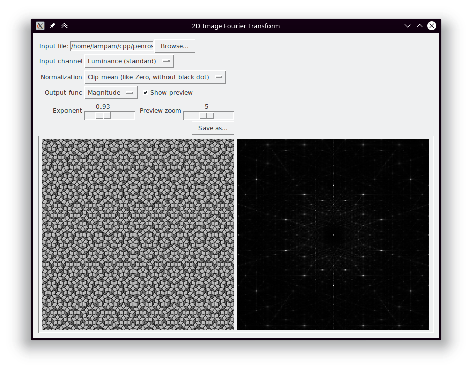

# Python Image FFT thing

## Usage

### Linux
```
git clone https://github.com/ExpHP/image-fft
cd image-fft

pip3 install .  # add --user if you get a permission error

image-fft --help  # for a CLI interface
image-fft-tk      # for a GUI
```

### Windows

Windows is explicitly supported, but prebuilt binaries are not yet available for distribution and no instructions are available yet for building them.

## Screenshot


